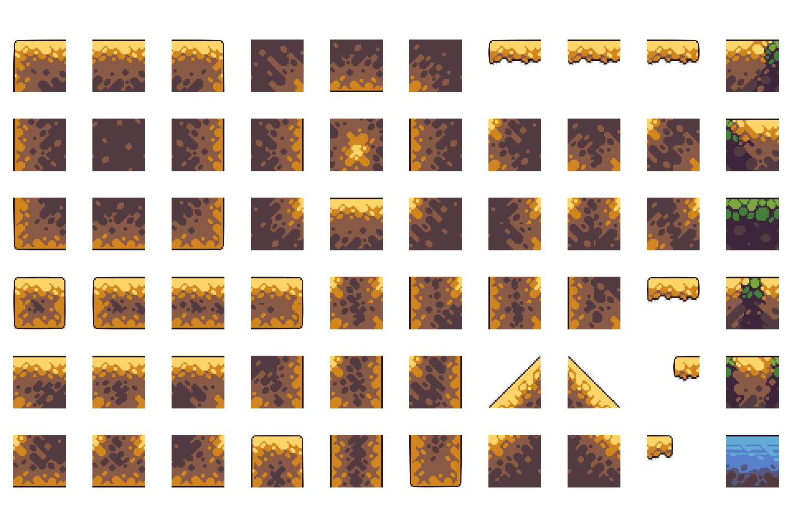
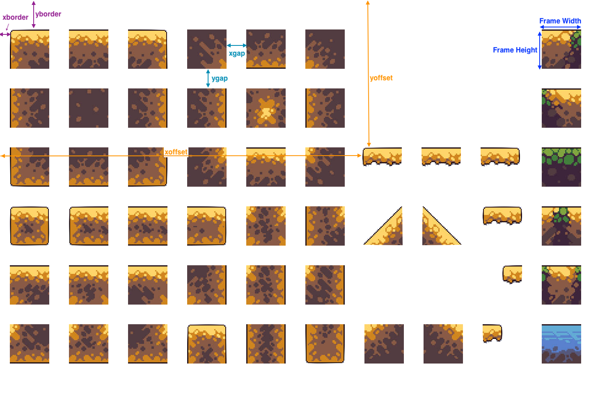

## Spriter - Explode tile map into images


### Example

**This command:**

```bash
python spriter.py action=extract inpath=Desert-2D-Tileset-Pixel-Art3.png  outpath=desert_frames name=desert cols=10 rows=6 frame_width=96 frame_height=96 direction=xy image_type=png xgap=48 ygap=48 xborder=24 yborder=72 
```

**Processed this file:**



**Into the folder** [HERE](../../Graphics/maps/desert_frames/)

### Help

<a href="spriter_help.png"></a>


### Extended Example

- I took this image (click on image to go to site) and used "Gimp" to remove the background color and add a clear channel. 

<a href="https://img.craftpix.net/2019/10/Sakura-Garden-Platformer-Game-Level-Tileset4.jpg"></a>

- Use Gimp or some image editor to find out how big the tiles are. This image has a few different sizes and to get ready we need the x and y border sizes along with the gap between tiles. If you want to forget about x and y borders, just crop the image.

- Figure out xborder: 144
- Figure out yborder: 128
- Figure out xgap: 25
- Figure out ygap: 30
- Figure out tilesize : 80x80

Now to grab the first two rows of the building tiles we could run

```bash
python spriter.py action=extract inpath=sakura.png  outpath=sakura_frames name=sakura cols=11 rows=2 frame_width=80 frame_height=80 direction=xy image_type=png xgap=25 ygap=30 xborder=144 yborder=128     
```

And we get the files [HERE](./sakura_frames/)