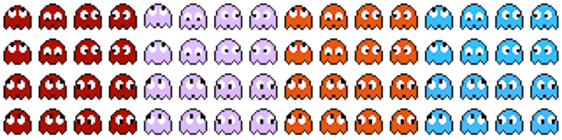

## P01.1 - Project 1  Part 1 Helper Files

### Code Files (lessons)

- **[P01-001_pyglesson.py](P01-001_pyglesson.py)**
  - This file is a basic player class (ball) getting us started with organizing our code.
  - It moves the player around in the x and y direction changing direction when a wall is collided with.
- **[P01-002_pyglesson.py](P01-002_pyglesson.py)**
  - Stops moving the player automatically.
  - Prints the integer values of keys that are pressed to the console.
  - This is just to show that every key on the keyboard has an associated integer value you can test for.
- **[P01-003_pyglesson.py](P01-003_pyglesson.py)**
  - Moves the player using arrow keys and pygame builtin globals (K_UP,K_DOWN,etc.) to move in a specific direction.
  - The globals are really just keywords with integer values (K_UP=273, K_DOWN=274,etc.).
- **[P01-004_pyglesson.py](P01-004_pyglesson.py)**
  - Same as previous but adds a "move with mouse"
  - Mouse movement is more of a teleport, rather than a move.
- **[P01-005_pyglesson.py](P01-005_pyglesson.py)**
  - Fixes mouse movement to "progress" towards a clicked mouse spot rather than teleport.
  - Adds some text printing to the screen.
- **[P01-006_pyglesson.py](P01-006_pyglesson.py)**
  - This adds a "tiled" background creating a grid. Not going to use this method.
- **[P01-007_pyglesson.py](P01-007_pyglesson.py)**
  - This attempts to draw a tiled grid AND move tiled grid in any direction.
  - I had to let this go because it was taking me a while to code AND I thought it would be to CPU intensive with all the redrawing AND shifting.
- **[P01-008_pyglesson.py](P01-008_pyglesson.py)**
  - This adds a sprite sheet to show simple character animation.

- **[P01-009_scrolling_background_any.py](P01-009_scrolling_background_any.py)**
  - Uses same sprite sheet and the following background to show moving in any direction.

- **[P01-scrolling_background_side.py](P01-scrolling_background_side.py)**
  - Uses the following background image and a edited background trick to do a side scroller.

### Other Files and Folder

- **[media](media)**
  - Lots of (mostly unused) images for use.
- **[colors.json](colors.json)**
  - Json file that holds colors in hex and rgb formats.
- **[helper_module.py](helper_module.py)**
  - Include file with common functions used by many files.
-**logger.txt**
  - would be output of the Logg class in the helper module.
-